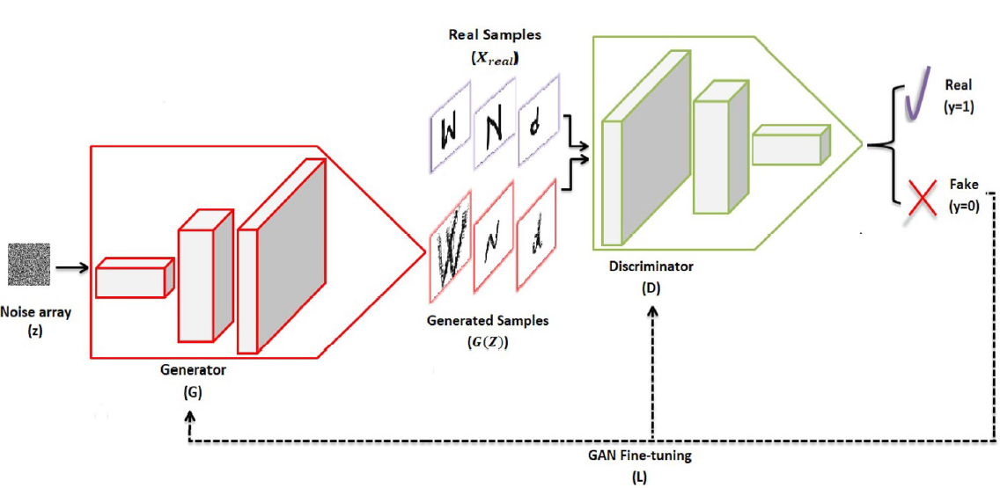
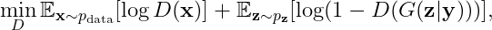

# Proyecto final de Machine Learning

# Resumen del trabajo

En el presente trabajo se implementó una red llamada Conditional Generative Adversarial Networks (cGAN) utilizando TensorFlow y Keras. El objetivo fue entrenar la red con los datasets MNIST, CIFAR-10 y CIFAR-100 para generar imágenes correspondientes a cada uno de estos conjuntos de datos. Se exploraron diversas variantes de la cGAN basadas en investigaciones previas, tales como la adición de capas y la modificación de parámetros, con el propósito de mejorar la precisión, reducir la pérdida y obtener imágenes de mayor calidad

Durante el desarrollo del proyecto, se experimentó con diferentes arquitecturas y técnicas de regularización para optimizar el rendimiento del generador y el discriminador de la cGAN. Se observó que el modelo logró resultados prometedores en la generación de imágenes del conjunto de datos MNIST, con resultados variables en CIFAR-10 y desafíos significativos en CIFAR-100. Las métricas de evaluación como la precisión, el puntaje F1 y la pérdida mostraron comportamientos esperados en el conjunto de entrenamiento, pero con variabilidad en el conjunto de prueba.vLos resultados mostraron que el generador de la cGAN pudo generar imágenes del MNIST de manera precisa, no obstante el desempeño con el CIFAR-10 fue muy bajo y para el CIFAR-100 fue aún peor. Las métricas como la precisión (accuracy), el F1-score y la pérdida (loss) indicaron un buen desempeño en el conjunto de entrenamiento pero mostraron mucha variabilidad y ruido en el conjunto de prueba.

# Análisis Exploratorio de Datos (EDA) y PCA

Se realizó un análisis exploratorio de datos (EDA) sobre los datasets utilizados, seguido de un análisis de Componentes Principales (PCA) para explorar la estructura y la varianza de los datos.

- Análisis Exploratorio de Datos (EDA)

Inicialmente, se realizó un análisis exploratorio de datos utilizando el paquete Pandas de Python para explorar la distribución y la estructura del dataset. Este análisis incluyó:

Distribución del Contenido del Dataset: Se examinó la distribución de las etiquetas y las características del dataset utilizando funciones como describe(), info() e histogramas y para comprender la variabilidad y la frecuencia de los datos.

Análisis de Componentes Principales (PCA)
Posteriormente, se aplicó el análisis de Componentes Principales (PCA) para explorar la estructura de los datos en un espacio dimensional reducido. Los hallazgos incluyeron:

Suma Acumulada de la Varianza: Se calculó la suma acumulada de la varianza explicada por los componentes principales. Se observó que la varianza explicada alcanza valores cercanos a 1 después de considerar aproximadamente 200 componentes principales, lo que sugiere que estos componentes capturan la mayoría de la variabilidad en los datos.

Gráfico de Componentes Principales: Se realizó un gráfico de dispersión de dos componentes principales seleccionados para visualizar la estructura de los datos en un espacio bidimensional. Se observó que la información está bastante mezclada en este espacio reducido, indicando una posible superposición o complejidad en la distribución de las clases o categorías del dataset.

Este análisis exploratorio y de PCA proporcionó información valiosa sobre la estructura y la variabilidad de los datos, lo cual es fundamental para comprender cómo se distribuyen las clases o categorías en el dataset y para preparar adecuadamente los datos para la construcción y evaluación de modelos de aprendizaje automático.

Conclusiones del Análisis
El EDA reveló patrones importantes en la distribución y estructura del dataset, mientras que el PCA destacó la necesidad de considerar un número significativo de componentes principales para capturar la mayoría de la varianza en los datos. Estos hallazgos son fundamentales para guiar la selección de características, la preparación de datos y el diseño de modelos en futuros desarrollos en Machine Learning basados en este dataset específico.

# Teoría de las Conditional Generative Adversarial Networks (cGANs)

Las cGANs son una extensión de las Generative Adversarial Networks (GANs). Primero definamos las GANs. Estas consisten en dos redes neuronales que compiten entre sí: un generador (G) y un discriminador (D). El generador crea imágenes falsas a partir de ruido aleatorio, mientras que el discriminador trata de distinguir entre las imágenes reales del conjunto de datos y las imágenes falsas generadas por el generador. El objetivo del generador es engañar al discriminador para que no pueda diferenciar entre las imágenes reales y las generadas.

Por otra parte, las cGANs introducen una condición adicional en ambas redes, lo que permite generar imágenes específicas de una clase determinada. Esta condición puede ser cualquier tipo de información adicional, en este trabajo la condición era la etiqueta de cada imagen, por ejemplo en el MNIST las etiquetas eran los dígitos de cada imagen y en el CIFAR el objeto, persona o animal que estaba en la imagen. Así, el generador no solo toma un vector de ruido como entrada, sino también la condición, y genera una imagen correspondiente a esa condición. El discriminador, por su parte, recibe tanto la imagen (real o generada) como la condición y debe determinar si la imagen es real o falsa. En la figura se detalla la cGAN en general. A continuación profundizaremos en su arquitectura e implementación

# Construcción del Generador y el Discriminador en una cGAN

# Generador (G)

El generador en una cGAN es responsable de crear imágenes sintéticas que se asemejan a las imágenes reales del conjunto de datos. En esta implementación, el generador toma dos entradas: un vector de ruido y una etiqueta de clase. El proceso de construcción del generador se puede resumir en los siguientes pasos:

- Entrada de Etiquetas y Embedding:
    El generador recibe una etiqueta de clase como entrada, que es procesada mediante una capa de embedding. Esta capa de embedding convierte la etiqueta de clase en un vector de dimensión fija, facilitando su integración con el vector de ruido.

- Transformación de la Etiqueta:
    La salida de la capa de embedding se pasa a través de una capa densa y se reconfigura en una forma adecuada para ser concatenada con el vector de ruido. Esto implica redimensionar el vector de embedding en una matriz de la misma resolución que una parte del ruido.

-Entrada de Ruido:
    El generador también recibe un vector de ruido, que se transforma mediante una capa densa para generar una matriz tridimensional.

- Concatenación:
    El vector transformado de la etiqueta de clase se concatena con la matriz transformada del vector de ruido, formando una entrada conjunta que combina tanto la información de la clase como el ruido aleatorio.

- Capas de Deconvolución:
    La entrada combinada pasa por varias capas de convolución transpuesta (deconvolución). Estas capas incrementan la resolución de la matriz paso a paso, transformando la matriz tridimensional en una imagen con la resolución correspondiente al MNIST o al CIFAR. Durante este proceso, se utilizan técnicas como la normalización por lotes (Batch Normalization) y funciones de activación Leaky ReLU para mejorar la estabilidad del entrenamiento y la calidad de las imágenes generadas. Además en cada capa de deconvolución disminuye la cantidad de filtros hasta que en la capa final se utilizan 3 filtros para obtener una imagen con tres canales (RGB).

- Generación de la Imagen Final:
    Finalmente, la capa de convolución transpuesta final genera la imagen de salida con la misma dimensión y canales de color que las imágenes del conjunto de datos original. Se utiliza una función de activación tangente hiperbólica (tanh) para asegurar que los valores de los píxeles estén en un rango adecuado.

# Discriminador (D)

El discriminador es una red neuronal que distingue entre imágenes reales y generadas. En una cGAN, también toma como entrada la etiqueta de clase correspondiente a la imagen. La construcción del discriminador se puede resumir en los siguientes pasos:

- Entrada de Etiquetas y Embedding:
    Similar al generador, el discriminador recibe una etiqueta de clase que se procesa mediante una capa de embedding. Esto convierte la etiqueta en un vector de dimensión fija.

- Transformación de la Etiqueta:
    El vector de embedding pasa por una capa densa y se redimensiona para coincidir con las dimensiones de las imágenes de entrada. Esto permite concatenar la información de la clase con la imagen.

- Entrada de la Imagen:
    El discriminador también recibe una imagen, que puede ser real o generada.

- Dropout:
    Se aplica una capa de Dropout para prevenir el sobreajuste.

- Concatenación:
    La imagen y el vector de embedding transformado se concatenan, formando una entrada conjunta que combina tanto la información de la imagen como la de la clase.

- Capas de Convolución:
    La entrada conjunta se pasa por una serie de capas de convolución. Estas capas extraen características de la imagen a través de múltiples filtros convolucionales que van aumentando con cada capa. Durante este proceso, se utilizan funciones de activación Leaky ReLU y normalización por lotes para mejorar la estabilidad del entrenamiento y la capacidad de generalización del discriminador.

- Clasificación Final:
    Las características extraídas se aplanan y pasan por una capa densa final que produce una probabilidad escalar. Esta probabilidad indica si la imagen es real o generada. Se utiliza una función de activación sigmoide para asegurar que la salida esté en el rango [0, 1] siendo 0 totalmente fake y 1 totalmente real.

# Cálculo de la Loss en cGANs

En una red Generative Adversarial Network (GAN), y por extensión en una Conditional GAN (cGAN), el objetivo es entrenar dos redes neuronales, un generador (G) y un discriminador (D), que compiten entre sí. El discriminador trata de distinguir entre las imágenes reales y las generadas por el generador, mientras que el generador intenta crear imágenes que sean indistinguibles de las reales para el discriminador.

En una Conditional Generative Adversarial Network (cGAN), las pérdidas del discriminador y del generador se definen según el siguiente juego minimax:

- Pérdida del Discriminador
    La pérdida del discriminador (D) se compone de dos términos: la pérdida para las imágenes reales y la pérdida para las imágenes generadas (falsas). 

    

    Aquí, \(D(\mathbf{x}) \) representa la probabilidad de que \(\mathbf{x}\) sea una imagen real y \( G(\mathbf{z}|\mathbf{y}) \) es la imagen generada por el generador condicionado por la etiqueta de clase \(\mathbf{y}\) y el ruido \(\mathbf{z}\).

- Pérdida del Generador
    La pérdida del generador (G) se basa en cómo el discriminador clasifica las imágenes generadas. El objetivo del generador es engañar al discriminador, haciéndole creer que las imágenes generadas son reales.

    .gif>)

    Sin embargo, en la práctica, se utiliza \( \max_G \mathbb{E}_{\mathbf{z} \sim p_{\mathbf{z}}}[\log D(G(\mathbf{z}|\mathbf{y})))], \) para el generador para mejorar la estabilidad del entrenamiento.

En resumen:
    El discriminador se entrena para maximizar la probabilidad de asignar la etiqueta correcta a las imágenes reales y generadas. El generador se entrena para minimizar la probabilidad de que el discriminador clasifique las imágenes generadas como falsas.

Claro, aquí te muestro cómo se verían las ecuaciones de las métricas de evaluación correctamente renderizadas:

# Teoría sobre Métricas de Evaluación en Machine Learning

En Machine Learning, las métricas de evaluación son herramientas clave para medir el rendimiento y la eficacia de los modelos entrenados. En este trabajo, se utilizó Precision, Recall, F1-score y Accuracy del paquete sklearn. A continuación, se explica cada una de estas métricas utilizadas en este trabajo:

- Accuracy (Exactitud)
    La exactitud es una medida general del rendimiento de un modelo y se calcula como el número de predicciones correctas dividido por el número total de predicciones realizadas.
    
    .gif>)

    - TP (True Positive): Número de ejemplos positivos que fueron correctamente clasificados como positivos.
    - TN (True Negative): Número de ejemplos negativos que fueron correctamente clasificados como negativos.
    - FP (False Positive): Número de ejemplos negativos incorrectamente clasificados como positivos.
    - FN (False Negative): Número de ejemplos positivos incorrectamente clasificados como negativos.

- Precision (Precisión)
    La precisión mide la proporción de ejemplos positivos que fueron correctamente identificados.

    .png>)

- Recall (Recuperación o Sensibilidad)
    El recall mide la proporción de ejemplos positivos que fueron correctamente identificados por el modelo.
    \[ \text{Recall} = \frac{\text{TP}}{\text{TP} + \text{FN}} \]

- F1-score

    El F1-score es la media armónica de precision y recall y proporciona un equilibrio entre ambas métricas. Es útil cuando hay clases desequilibradas en los datos.

    \[ \text{F1-score} = 2 \cdot \frac{\text{Precision} \cdot \text{Recall}}{\text{Precision} + \text{Recall}} \]

    El F1-score alcanza su mejor valor en 1 (precision y recall perfectos) y su peor valor en 0.

# Conclusiones del Trabajo

- Desempeño del Discriminador y Generador:
    El discriminador fue efectivo en distinguir imágenes reales de generadas en datasets simples como MNIST, pero tuvo más dificultades con CIFAR-10 y CIFAR-100 debido a la mayor complejidad de las imágenes. El generador logró crear imágenes realistas para MNIST, pero su capacidad disminuyó con la complejidad creciente de CIFAR-10 y CIFAR-100.

- Impacto de la Arquitectura:
    Variar la arquitectura de las redes tuvo un impacto significativo en el desempeño, especialmente en el manejo de datasets complejos. Las técnicas de regularización (Dropout y Batchnormalization) y la elección de hiperparámetros fueron cruciales para mejorar la estabilidad y la calidad de las imágenes generadas.

- Desafíos de Generalización:
    Las métricas mostraron que el modelo tiene dificultades para generalizar bien en datasets más complejos, lo que sugiere la necesidad de técnicas adicionales de mejora y optimización.

# Carpetas del repositorio. 

- Local: En esta carpeta se encuentran los modelos implementados de forma local para luego ser pasados a colab. Aquí es donde realizo modificaciones y pruebas. No están los resultados.

- Colab: Aquí se encuentran los resultados finales, luego de ser compilados por colab. Cada modelo tiene alguna variante en la arquitectura que se describirá a continuación. Los modelos fueron entrenados para los datasets mnist, CIFAR 100 y flowers 102. Al final de cada modelo se realiza una conclusión sobre los resultados obtenidos. 

- EDA: En esta carpeta se realizaron los Exploratory Data Analisys para los datasets mnist y CIFAR 100.

# Definición de los modelos utilizados.

- Modelo 1: 
 
    Tarea:
        cGAN que aprende del mnist y luego genera una imagen fake a partir de un número ingresado por teclado.

    Comentarios:
        Escencialmente la arquitectura es la implementada en https://www.geeksforgeeks.org/conditional-generative-adversarial-network/ donde entrenaron la red para aprender las imagenes del CIFAR10. En nuestro caso, modifiqué la implementación para aprender las imagenes del mnist. Además, agregué diversas medidas para evaluar la performance del modelo. Por último, agregué el código necesario para predecir una imagen de un número ingresado por el usuario.
    probar con regularizadores 
    model.add(layers.Conv2D(32, (3, 3), activation='relu', input_shape=(32, 32, 3), kernel_regularizer=regularizers.l2(0.0001)))

Modelo 2: 

    Tarea:
        cGAN que aprende del mnist y luego genera una imagen fake a partir de un número ingresado por teclado.

    Comentarios:
        Uso la arquitectura del paper donde escencialmente hay más capas 
        https://www.tensorflow.org/tutorials/generative/dcgan?hl=es-419

        
        noise = 100 
        encoding = 50 
        lr = 0.0002 
        estandar que usan todos

Conclusiones:
Fue muy positivo cambiar el optimizador de Adam a RMSprop, converge muy rapido
No fue demasiado buena la mejora a una red más compleja para el mnist. Hay que ver para el cifar 100 capaz el mnist al ser tan simple la red converge muy rapido. Probar si se ve la mejora en las redes para el cifar 100. Esto se puede argumentar con el pca si se ve que en el EDA el mnist es más fácil de procesar.

Escribir el tiempo que tomo con cada modelo

Optimize todo para np array

En v2 paso a numpy array

el modelo1 es el de geeks, el 2 es el del paper y el 3 es el del paper pero con menos conv transpuestas porque era demasiado tiempo de compilacion, el modelo 4 es igual que el 3 pero en el genereador hay un conv2d al final. En el modelo 4 agrego una capa más al generador con respecto al 3 y cambio el output por una conv en vez con transconv. En 3.1 solo cambio la capa de output del genereador  por una conv en vez con transconv

CIFAR10 
se utilizó el modelo 5 (el mas similar al del paper):
v1 (el que mejor anduvo): agregue momentum = 0.8 al batchnormalization del discriminador filtros del generador 512 256 128 64 capto mejor ciertas caracteristicas de las imagenes dropout al final del discriminador 
v2 agregue momentum = 0.8 al batchnormalization del discriminador filtros del generador 256 128 64 32 dropout al principio del discriminador como en el paper
v3 vi que muchos usan adam para la cgan para el cifar, a mi no me anduvo para el mnist. agrando el batch size a 50
v4 igual que v3 pero vuelvo a RMSprop

El cuello de botella esta en la cantidad de imagenes, no tanto en el numero de parametros ver que pasa cuando salto del m1 al m5

para que sirve la capa de dropout y la de batch

agregar capas convolucionales con mas filtros permite captar las caracteristicas de las imagenes
Adam no anda demasiado bien digamos en v3 para el cifar 10 no veo que gane nada