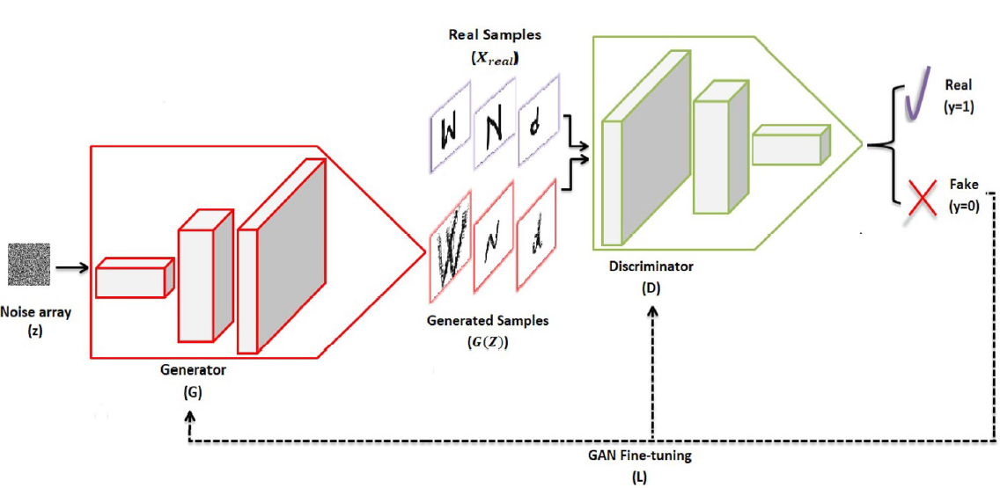
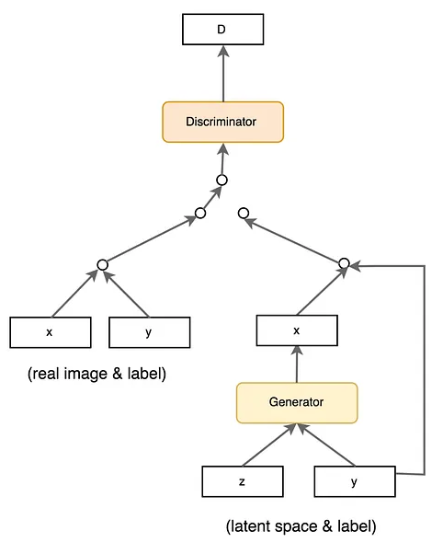
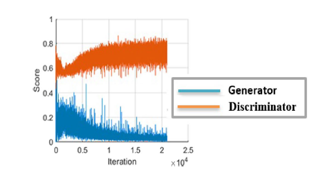
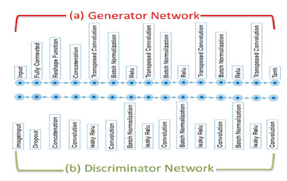

# Proyecto final de Machine Learning

## Importante: 

Los resultados obtenidos para cada modelo se encuentran en la carpeta [resultados](resultados). NO COMPILAR. Solo compilar el último bloque del archivo cgan_train_mX.ipynb para generar una imagen fake a pedido del usuario. La lista de etiquetas posibles se encuentra en el mismo bloque. En cada carpeta de resultados están los distintos modelos implementados para cada dataset. Los números de modelos hacen referencia a la arquitectura de los mismos mientras que las versiones de cada modelo corresponden a variaciones en los parámetros de los mismos (épocas, batchsize, etc). Además, en cada carpeta se encuentra la evolución de las imagenes fake producidas por el generador a lo largo de las épocas.

## Resumen del trabajo

En el presente trabajo se implementó una red llamada Conditional Generative Adversarial Networks (cGAN) utilizando TensorFlow y Keras. El objetivo fue entrenar la red con los datasets MNIST, CIFAR-10 y CIFAR-100 para generar imágenes correspondientes a cada uno de estos conjuntos de datos de forma controlada, es decir generar una imagen fake a pedido del usuario. Se exploraron diversas variantes de la cGAN basadas en investigaciones previas, tales como la adición de capas y modificación de parámetros con el propósito de mejorar la precisión, reducir la pérdida y obtener imágenes de mayor calidad.

Durante el desarrollo del proyecto, se experimentó con diferentes arquitecturas y técnicas de regularización para optimizar el rendimiento del generador y el discriminador de la cGAN. Se observó que utilizando cGAN en general, se lograron resultados muy positivos en la generación de imágenes del conjunto de datos MNIST, mientras que para el CIFAR-10 y CIFAR-100, no fue tan positivo el resultado. Las métricas de evaluación como la precisión, el puntaje F1 y la pérdida mostraron comportamientos esperados en el conjunto de entrenamiento, pero con mucha variabilidad en el conjunto de prueba. Los resultados mostraron que el generador de la cGAN pudo generar imágenes del MNIST de manera precisa, no obstante el desempeño con el CIFAR-10 fue muy bajo y para el CIFAR-100 fue aún peor. 

## Análisis Exploratorio de Datos (EDA) y PCA

Se realizó un análisis exploratorio de datos ([EDA](EDA)) sobre los datasets utilizados, seguido de un análisis de Componentes Principales (PCA) para explorar la estructura y la varianza de los datos.

Inicialmente, se realizó un análisis exploratorio de datos utilizando el paquete Pandas de Python para explorar la distribución y la estructura del dataset. Este análisis incluyó examinar la distribución de las etiquetas y las características del dataset utilizando funciones como describe(), info() e histogramas y para comprender la variabilidad y la frecuencia de los datos. Para el MNIST y el CIFAR 10, cada pixel por cada canal representa una característica de la imagen, de esta manera el MNIST tiene 28x28x1 + 1 = 785 features y el CIFAR10 32x32x3 + 1 = 3073 features (donde también se esta contando el label correspondiente a la imagen).

Posteriormente, se aplicó el análisis de Componentes Principales (PCA) para explorar la estructura de los datos en un espacio dimensional reducido. Se calculó la suma acumulada de la varianza explicada por los componentes principales. Para el MNIST se observó que la varianza explicada alcanza valores cercanos a 1 después de considerar aproximadamente 200 componentes principales mientras que para el CIFAR10 se requieren 400. Esto sugiere que se necesitan un gran número de componentes para capturar la mayoría de la variabilidad en los datos. 

Además, se realizó un gráfico de dispersión en función de las dos componentes principales para visualizar la estructura de los datos en un espacio bidimensional. En el MNIST se observó que cada uno de los digitos se encuentra concentrado en una zona del espacio pero sin embargo las nubes de puntos correspondientes a cada dígito están mezclada en este espacio reducido, indicando complejidad en la distribución de las clases. Para el CIFAR10 la información se distribuye en todo el espacio de forma prácticamente homogenea.

## Teoría de las Conditional Generative Adversarial Networks (cGANs)

Las cGANs son una extensión de las Generative Adversarial Networks (GANs). Primero definamos las GANs. Estas consisten en dos redes neuronales que compiten entre sí: un generador (G) y un discriminador (D). El generador crea imágenes falsas a partir de ruido aleatorio, mientras que el discriminador trata de distinguir entre las imágenes reales del conjunto de datos y las imágenes falsas generadas por el generador. El objetivo del generador es engañar al discriminador para que no pueda diferenciar entre las imágenes reales y las generadas.

Por otra parte, las cGANs introducen una condición adicional en ambas redes, lo que permite generar imágenes específicas de una clase determinada. Esta condición puede ser cualquier tipo de información adicional, en este trabajo la condición era la etiqueta de cada imagen, por ejemplo en el MNIST las etiquetas eran los dígitos de cada imagen y en el CIFAR el objeto, persona o animal que estaba en la imagen. Así, el generador no solo toma un vector de ruido como entrada, sino también la condición, y genera una imagen correspondiente a esa condición. El discriminador, por su parte, recibe tanto la imagen (real o generada) como la condición y debe determinar si la imagen es real o falsa. En la figura se detalla la cGAN en general. A continuación profundizaremos en su arquitectura e implementación

## Construcción del Generador y el Discriminador en una cGAN

## Generador (G)

El generador en una cGAN es responsable de crear imágenes sintéticas que se asemejan a las imágenes reales del conjunto de datos. En esta implementación, el generador toma dos entradas: un vector de ruido y una etiqueta de clase. El proceso de construcción del generador se puede resumir en los siguientes pasos:

- Entrada de Etiquetas y Embedding:
    El generador recibe una etiqueta de clase como entrada, que es procesada mediante una capa de embedding. Esta capa de embedding convierte la etiqueta de clase en un vector de dimensión fija, facilitando su integración con el vector de ruido.

- Transformación de la Etiqueta:
    La salida de la capa de embedding se pasa a través de una capa densa y se reconfigura en una forma adecuada para ser concatenada con el vector de ruido. Esto implica redimensionar el vector de embedding en una matriz de la misma resolución que una parte del ruido.

- Entrada de Ruido:
    El generador también recibe un vector de ruido, que se transforma mediante una capa densa para generar una matriz tridimensional.

- Concatenación:
    El vector transformado de la etiqueta de clase se concatena con la matriz transformada del vector de ruido, formando una entrada conjunta que combina tanto la información de la clase como el ruido aleatorio.

- Capas de Deconvolución:
    La entrada combinada pasa por varias capas de convolución transpuesta (deconvolución). Estas capas incrementan la resolución de la matriz paso a paso, transformando la matriz tridimensional en una imagen con la resolución correspondiente al MNIST o al CIFAR. Durante este proceso, se utilizan técnicas como la normalización por lotes (Batch Normalization) y funciones de activación Leaky ReLU para mejorar la estabilidad del entrenamiento y la calidad de las imágenes generadas. Además en cada capa de deconvolución disminuye la cantidad de filtros hasta que en la capa final se utilizan 3 filtros para obtener una imagen con tres canales (RGB).

- Generación de la Imagen Final:
    Finalmente, la capa de convolución transpuesta final genera la imagen de salida con la misma dimensión y canales de color que las imágenes del conjunto de datos original. Se utiliza una función de activación tangente hiperbólica (tanh) para asegurar que los valores de los píxeles estén en un rango adecuado.

## Discriminador (D)

El discriminador es una red neuronal que distingue entre imágenes reales y generadas. En una cGAN, también toma como entrada la etiqueta de clase correspondiente a la imagen. La construcción del discriminador se puede resumir en los siguientes pasos:

- Entrada de Etiquetas y Embedding:
    Similar al generador, el discriminador recibe una etiqueta de clase que se procesa mediante una capa de embedding. Esto convierte la etiqueta en un vector de dimensión fija.

- Transformación de la Etiqueta:
    El vector de embedding pasa por una capa densa y se redimensiona para coincidir con las dimensiones de las imágenes de entrada. Esto permite concatenar la información de la clase con la imagen.

- Entrada de la Imagen:
    El discriminador también recibe una imagen, que puede ser real o generada.

- Dropout:
    Se aplica una capa de Dropout para prevenir el sobreajuste.

- Concatenación:
    La imagen y el vector de embedding transformado se concatenan, formando una entrada conjunta que combina tanto la información de la imagen como la de la clase.

- Capas de Convolución:
    La entrada conjunta se pasa por una serie de capas de convolución. Estas capas extraen características de la imagen a través de múltiples filtros convolucionales que van aumentando con cada capa. Durante este proceso, se utilizan funciones de activación Leaky ReLU y normalización por lotes para mejorar la estabilidad del entrenamiento y la capacidad de generalización del discriminador.

- Clasificación Final:
    Las características extraídas se aplanan y pasan por una capa densa final que produce una probabilidad escalar. Esta probabilidad indica si la imagen es real o generada. Se utiliza una función de activación sigmoide para asegurar que la salida esté en el rango [0, 1] siendo 0 totalmente fake y 1 totalmente real.

## Cálculo de la Loss en cGANs (juego minimax)

En una Generative Adversarial Network (GAN), y por extensión en una Conditional GAN (cGAN), el objetivo es entrenar dos redes neuronales, un generador (G) y un discriminador (D), que compitan entre sí. En dicha competencia, el discriminador trata de distinguir entre las imágenes reales y las generadas por el generador, mientras que el generador intenta crear imágenes que sean indistinguibles de las reales para el discriminador.

En una Conditional Generative Adversarial Network (cGAN), el generador captura la distribución de los datos y se entrena de manera que intenta maximizar la probabilidad de que el discriminador cometa un error. El discriminador, por otro lado, se basa en un modelo que estima la probabilidad de que la muestra que recibe proviene de los datos de entrenamiento y no del generador. Las GANs se formulan como un juego de minimax, donde el discriminador intenta maximizar su recompensa V(D, G) y el generador intenta minimizar la recompensa del discriminador, o en otras palabras, maximizar su pérdida. Esto se puede describir matemáticamente con la siguiente fórmula:

.png>)

donde E representa el operador de esperanza y se utiliza para denotar el valor esperado de una variable aleatoria. En este contexto, E_{x ~ p_{data}} representa el valor esperado con respecto a la distribución de datos reales p_{data}(x), E_{z ~ p_z(z)} representa el valor esperado con respecto a la distribución de ruido p_z(z), e y representa la etiqueta debido a que estamos trabajando con una conditional GAN.

En la fórmula, el primer término del lado derecha incentiva al discriminador a clasificar correctamente las muestras reales mientras que el segundo término incentiva al generador a producir muestras que sean clasificadas como reales por el discriminador.

En resumen:
    El discriminador se entrena para maximizar la probabilidad de asignar la etiqueta correcta a las imágenes reales y generadas. El generador se entrena para minimizar la probabilidad de que el discriminador clasifique las imágenes generadas como falsas. En la siguiente figura se esquematiza el proceso descripto.

## Teoría sobre Métricas de Evaluación en Machine Learning

En Machine Learning, las métricas de evaluación son herramientas clave para medir el rendimiento y la eficacia de los modelos entrenados. En este trabajo, se utilizó Precision, Recall, F1-score y Accuracy del paquete sklearn. A continuación, se explica cada una de estas métricas utilizadas en este trabajo:

- Accuracy (Exactitud)
    La exactitud es una medida general del rendimiento de un modelo y se calcula como el número de predicciones correctas dividido por el número total de predicciones realizadas.

    .png>)

    - TP (True Positive): Número de ejemplos positivos que fueron correctamente clasificados como positivos.
    - TN (True Negative): Número de ejemplos negativos que fueron correctamente clasificados como negativos.
    - FP (False Positive): Número de ejemplos negativos incorrectamente clasificados como positivos.
    - FN (False Negative): Número de ejemplos positivos incorrectamente clasificados como negativos.

- Precision (Precisión)
    Proporción de verdaderos positivos sobre el total de predicciones positivas.

    .png>)

- Recall (Recuperación o Sensibilidad)
    Proporción de verdaderos positivos sobre el total de ejemplos positivos.

    .png>)

- F1-score
    El F1-score es la media armónica de precision y recall y proporciona un equilibrio entre ambas métricas. Es útil cuando hay clases desequilibradas en los datos.

    .png>)

    El F1-score alcanza su mejor valor en 1 (precision y recall perfectos) y su peor valor en 0.

## Resultados y discusión de cada modelo

En este punto se mencionarán las características más relevantes de cada modelo. Para más detalles se puede entrar a cada archivo .ipynb donde se encontrá la implementación completa de cada modelo.

- modelo_1_mnist: 
    Esencialmente la arquitectura es la implementada en https://www.geeksforgeeks.org/conditional-generative-adversarial-network/ donde entrenaron la red para aprender las imágenes del CIFAR10. En este caso, se modificó la implementación para aprender las imagenes del mnist. Además, se agregaron diversas medidas para evaluar la performance del modelo. Por último, se agregó el código necesario para predecir una imagen de un número ingresado por el usuario. 

    Esta arquitectura cuenta con dos capas de deconvolución en el generador, 2 capas de deconvolución en el discriminador y no varía la cantidad de filtros. Originalmente la red utilizaba un optimizador Adam pero las imagenes producidas eran totalmente oscuras por lo que se cambió a un optimizador RMSprop muy utilizado en general para las cGANs. Esta arquitectura cuenta con aproximadamente 1M de parámetros (se puede ver en el archivo .ipynb).

    Cada época consiste en procesar 60000 datos de entrenamiento y 10000 datos de validación, demorando en este caso aproximadamente 58 segundos. 

    Se graficó la Loss para cada iteración obteniendo resultados muy ruidosos pero similares al obtenido en trabajos anteriores (ver figura).

    

    Este resultado es consistente con el hecho de que las cGANs se entrenan mediante un juego de mini-max de dos jugadores donde el generador y el discriminador compiten entre sí. Este proceso competitivo lleva a ambos modelos a mejorar continuamente hasta que alcanzan un equilibrio en el que las imágenes generadas son muy realistas y difíciles de distinguir de las imágenes reales. 

    En cuanto a la loss para las epocas se observa que el conjunto de testeo es muy ruidoso pero sigue el comportamiento del conjunto de entrenamiento, ocurre lo mismo para las métricas del discriminador. En el discriminador se observa que luego de 20 épocas comienza a disminuir el rendimiento del mismo. A partir de esta última observación se reentrenó el modelo hasta la iteración 20 (v2). Las métricas del discriminador indican buen desempeño del mismo clasificando imagenes llegando a valores de accuracy de 0.9 aproximadamente.

    Finalmente, se puede observar que las imagenes fake de los dígitos son muy buenas, logrando captar la caligrafía aprendida del MNIST llegando al punto en que un humando no puede distinguir si es parte del dataset o es generada por la red.

    Nota: En la versión 1 no se pueden generar imagenes fake con este modelo porque se importó en formato .keras que luego me enteré que es incompatible y que debía exportar en formato .h5. No obstante en la carpeta evolution se pueden ver las imagenes fake producidas para cada dígito. En la versión 2 sí se puede.

- modelo_3_mnist:
    Este modelo es una versión reducida del siguiente [paper](papers/41598_2022_Article_20654.pdf). A diferencia del modelo 1 cuenta con más capas de deconvolución en el generador y discriminador, cantidad variable de filtros, tamaño de filtro más grande y capas de Dropout y batchnormalization. Esta arquitectura cuenta con aproximadamente 5M de parámetros.

    Originalmente la red implementada en este trabajo se utilizó para generar imagenes fake de letras en todos los idiomas para hacer transfer learning, por lo tanto, se infirió que debía ser buena para generar los digitos del mnist. No obstante, la gráfica de la loss muestra comportamientos extraños para el conjunto de testeo, muy ruidosos. Además, se obtuvo  demasiado buen desempeño del discriminador, es decir loss casi nula y precisión mayor a 0.9. Todo esto indicaría que esta red está overfiteando, posiblemente debido a que es una red muy compleja para un conjunto de entrenamiento relativamente sencillo como el MNIST. 

    Las imagenes predecidas muestran, al igual que el modelo 1 que el generador es capaz de producir perfectamente las imagenes fake para cada dígito.

    Cabe destacar que si bien aumentó 5 veces la cantidad de parámetros el tiempo de cada época es de aproximadamente 64 segundos. Lo cual no es un gran aumento de tiempo, esto es indicativo de que el cuello de botella está en el número de imágenes a procesar

    Nota: Aquí tampoco hay generador, porque también lo exporté en formato .keras. No obstante en la carpeta evolution se pueden ver las imagenes fake producidas para cada dígito.

- modelo_3_cifar100:
    El uso del modelo 3 para el cifar100 muestra resultados que indican nuevamente un posible overfitting del discriminador. Se observa que luego de pocas épocas la precisión y el accuracy del discriminador bajan para el conjunto de testeo y se van casi a 1 para el conjunto de entrenamiento. En este caso, la loss del discriminador baja muy rápido a valores bajos mientras que para el generador parece aumentar con una tasa cada vez más baja.

   El tiempo de cada época es de aproximadamente 55 segundos. Lo cual continua en la dirección de que el cuello de botella está en el número de imágenes a procesar ya que este conjunto cuenta con menos imagenes que el MNIST (50000 de entranamiento y 10000 de validación).

   Las imagenes obtenidas están lejos de ser lo que uno espera aunque para ciertas categorias se obtienen resultados que indican que la red aprendió ciertas características de la imagenes. Por ejemplo si uno le pide un sunflower, en general es amarillo, una apple es roja, si pide un clock es redondo o si pide una montaña se observa un triangulo blanco y un cielo celeste.

   Cabe destacar que las imágenes del CIFAR 10 y CIFAR 100 son de muy baja resolución y hasta dificil de entender por los humanos.

- modelo_4_cifar100:
    Es una ligera variante del modelo 3, el generador tiene una capa de deconvolución extra y la última capa se cambió por una convolucional y aproximadamente 200k parámetros más. El cambio de la última capa se realizó debido a que en el modelo 1 es de esta forma, mientras que el modelo 3 cuenta con todas capas de deconvolución en el generador.

    En la evaluación del modelo, las métricas, función loss, tiempo de compilación no se observan cambios significativos al modelo 3. Sin embargo, en las imagenes generadas se observa una mejora. Esto puede ser debido a que añadir más capas al generador, le permite al modelo captar mejor las características de cada imagen.

- modelo_5_cifar100:
    Este modelo es ahora una versión más compleja del modelo 3 y 4, cuenta con 4 capas de deconvolución en el generador y 5 capas de convolución en el discriminador por lo que cuenta con una cantidad mucho más grandes de filtros llegando a tener 55M de parámetros. Esta versión sí es como la del [paper](papers/41598_2022_Article_20654.pdf) citado anteriormente . En la figura se muestra un diagrama de su arquitectura

    

    El tiempo de compilación fue de 115 segundos, lo cual es muy bueno teniendo en cunta que hay muchos más parámetros. Esto indica que el cuello de botella está en el número de imágenes.

    Las conclusiones son las mismas que para el modelo 4. La evaluación del modelo, las métricas, función loss, tiempo de compilación no se observan cambios significativos, sin embargo las imagenes obtenidas son cada vez más fieles a lo que es espera. Sin embargo, la mayoría de las veces no representan nada.

    Nota: Este modelo es demasiado grande para subir a github. Si es necesario yo lo tengo para generar imagenes de forma local.

- modelo_5_cifar10:
    La implementación del modelo 5 para el CIFAR10 fue más satisfactoria que para el CIFAR100 debido a que la red tiene muchas más imágenes de una misma categoría para entrenar. En las distintas versiones se fueron probando diferentes estrategias basado en modelos similares encontrados en internet por ejemplo en https://www.tensorflow.org/tutorials/generative/pix2pix?hl=es-419.

    - V1: Se agregó momentum = 0.8 al batchnormalization del filtros del generador. Se utilizaron: 512 256 128 64 filtros a lo largo de cada capa deconvolucional y se agregó dropout al final del discriminador.
    - V2: Con respecto a V1 se cambiaron los filtros del generador a 256 128 64 32 y se cambió el dropout al principio del discriminador.
    - V3: Se cambió el optimizar a Adam agrando el batch size a 50 y cambié el batchsize a 50.
    - V4: Igual que v3 pero se volvió a RMSprop.

    Las versiones 1 y 2 tienen pocas épocas debido al tiempo de compilación que permitía COLAB. En las versiones 3 y 4 se observa una mejoría en las funciones de loss indicando overfitting a partir de la quinta época. 

    En este caso, existen imágenes generadas que se asemejan a lo esperado y un humano externo puede identificar qué es solo viendo la imagen. Sin embargo, hay que realizar varias generaciones de una misma imágen hasta obtener una buena imagen que se parezca a lo esperado.

## Conclusiones del Trabajo

A lo largo del desarrollo de este proyecto, se implementaron y evaluaron múltiples modelos de Redes Generativas Adversariales Condicionales (cGANs) para la generación de imágenes en diferentes datasets, incluyendo MNIST, CIFAR10 y CIFAR100. Cada modelo fue ajustado y modificado basándose en arquitecturas implementadas en trabajos anteriores, con el objetivo de mejorar la precisión, reducir la loss y generar imágenes de mejor calidad.

Los resultados indican que la arquitectura y la complejidad del modelo son factores cruciales que afectan directamente el rendimiento de las cGANs. Se observó que modelos con menos capas y parámetros tienden a ser más efectivos para datasets simples como MNIST, mientras que los datasets más complejos como CIFAR100 requieren modelos más sofisticados con un mayor número de capas y parámetros. Sin embargo, un aumento excesivo en la complejidad puede llevar a problemas de sobreajuste, especialmente en datasets con menor número de ejemplos por categoría.

En términos de generación de imágenes, los modelos más simples mostraron buenos resultados para datasets menos complejos, logrando generar imágenes de alta calidad que eran difíciles de distinguir de las reales. Para datasets más complejos, aunque hubo mejoras en la calidad de las imágenes generadas con modelos más complejos, las imágenes aún no alcanzan un nivel de realismo completamente satisfactorio, indicando la necesidad de más investigaciones y ajustes.

En resumen, el desarrollo y evaluación de diferentes variantes de cGANs mostraron que es posible generar imágenes realistas, pero la calidad y precisión dependen en gran medida de la complejidad del modelo y del dataset utilizado. Las estrategias de regularización y la elección de hiperparámetros juegan un papel fundamental en el rendimiento de las cGANs. Estas conclusiones proporcionan una base sólida para futuras investigaciones y mejoras en el campo de las redes generativas adversariales.